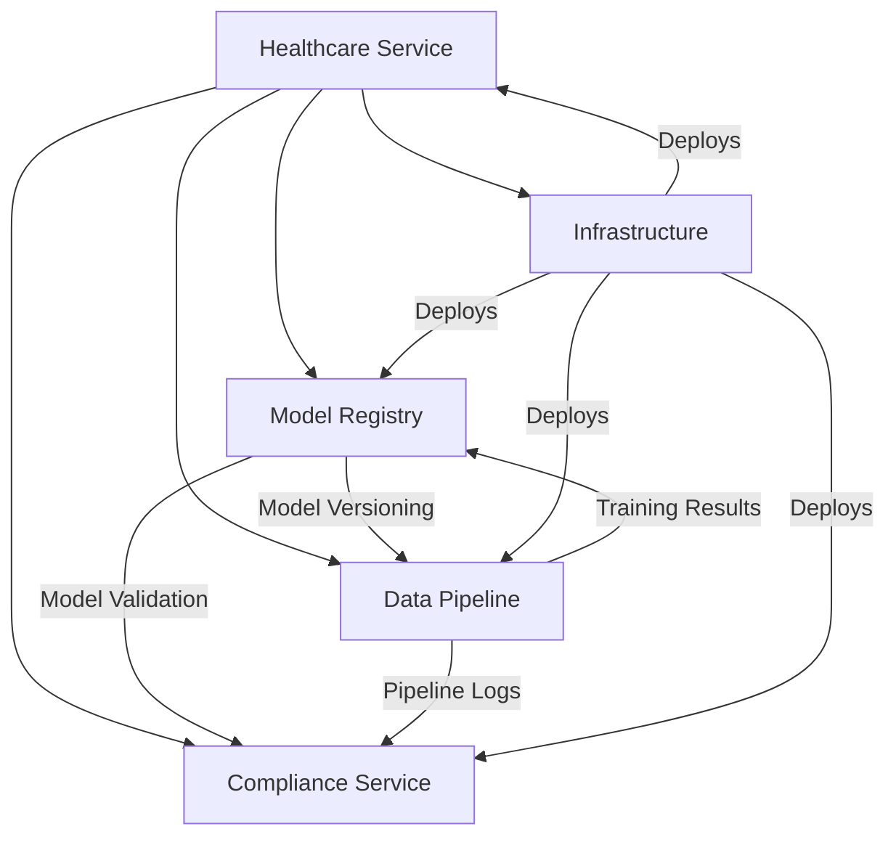
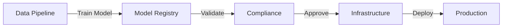
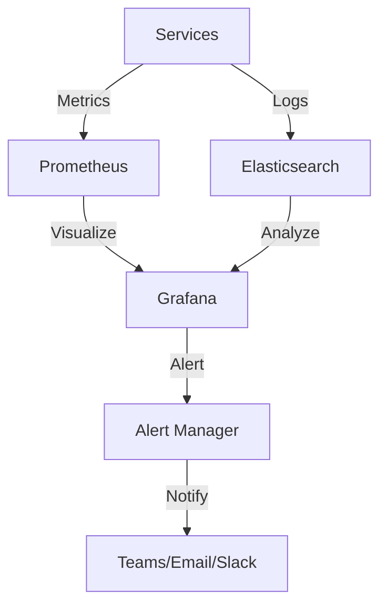

# Monitor.AI - Healthcare ML Monitoring Platform

A comprehensive platform for monitoring and managing healthcare ML models with focus on compliance, reliability, and performance.

## Repository Structure

```
monitor.ai/
├── core/                    # Core service implementations
│   ├── healthcare/         # Healthcare ML service
│   ├── model_registry/     # Model versioning and management
│   ├── data_pipeline/      # Data processing and training pipelines
│   └── compliance/         # Compliance monitoring and auditing
├── services/               # Frontend and auxiliary services
│   └── frontend/          # React-based web interface
├── shared/                # Shared components and configurations
│   ├── api.Dockerfile     # Base API Dockerfile
│   └── model_registry.Dockerfile
├── infrastructure/        # Infrastructure as Code
│   ├── kubernetes/       # Kubernetes configurations
│   ├── terraform/        # Infrastructure provisioning
│   ├── monitoring/       # Monitoring stack (Prometheus/Grafana)
│   └── ci-cd/           # CI/CD configurations
└── tests/                # Test suites
    └── healthcare/       # Healthcare service tests
```

## System Architecture



## Quick Start

1. **Clone the Repository**:
```bash
git clone https://github.com/realjules/monitor.ai.git
cd monitor.ai
```

2. **Set up Infrastructure**:
```bash
# Create infrastructure using Terraform
cd infrastructure/terraform
terraform init
terraform apply

# Deploy Kubernetes components
cd ../kubernetes
kubectl apply -k base/
```

3. **Start Monitoring Stack**:
```bash
# Install monitoring components
helm install prometheus prometheus-community/kube-prometheus-stack
helm install grafana grafana/grafana
```

4. **Start Core Services**:
```bash
# Build and start all services
docker-compose up -d

# Start frontend development server
cd services/frontend
npm install
npm run dev
```

## Core Components

### Healthcare Service
- Provides ML-based healthcare analysis
- Manages patient data and predictions
- Integrates with all other services
- Ensures HIPAA compliance

### Model Registry
- Stores and versions ML models
- Manages model metadata
- Handles model deployment
- Integrates with:
  * Data Pipeline (receives trained models)
  * Compliance (for model validation)
  * Infrastructure (for deployment)

### Data Pipeline
- Processes training data
- Trains models
- Validates results
- Integrates with:
  * Model Registry (stores trained models)
  * Compliance (logs training activities)
  * Infrastructure (for compute resources)

### Compliance Service
- Monitors all activities
- Enforces policies
- Generates compliance reports
- Integrates with:
  * Model Registry (validates models)
  * Data Pipeline (audits training)
  * Infrastructure (logs activities)

### Infrastructure
- Manages all infrastructure
- Handles deployments
- Monitors system health
- Integrates with:
  * All other services
  * Cloud providers
  * Kubernetes clusters

## Service Access Points

```plaintext
Frontend UI:     http://localhost:52209
Model Registry:  http://localhost:8000
Data Pipeline:   http://localhost:8080
Compliance:      http://localhost:8001
Grafana:         http://localhost:3000
Prometheus:      http://localhost:9090
```

## Development Workflow



## Monitoring Architecture



## Development

1. **Local Development Setup**:
```bash
# Install dependencies
pip install -r requirements.txt
npm install --prefix services/frontend

# Start services in development mode
docker-compose -f docker-compose.dev.yml up
```

2. **Running Tests**:
```bash
# Run all tests
python -m pytest tests/

# Run specific test suite
python -m pytest tests/healthcare/
```

## Security Features

- HIPAA Compliance monitoring
- Audit logging
- Access control and authentication
- Encrypted data storage and transmission
- Regular security scanning

## Contributing

1. Fork the repository
2. Create your feature branch (`git checkout -b feature/amazing-feature`)
3. Commit your changes (`git commit -m 'Add amazing feature'`)
4. Push to the branch (`git push origin feature/amazing-feature`)
5. Open a Pull Request

## License

This project is licensed under the MIT License - see the LICENSE file for details